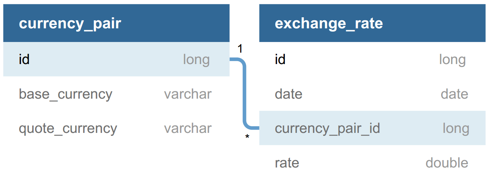

# Forex API

[](https://travis-ci.com/wijayaerick/forex-api)

API for managing foreign exchange for currencies

* [Running the API](#running-the-api)
  - [With Docker](#with-docker)
  - [Run Locally](#run-locally)
* [API Reference](#api-reference)
  - [Currency Pair](#currency-pair)
  - [Exchange Rate](#exchange-rate)
* [Database Design](#database-design)
* [Setup Environment Variables](#setup-environment-variables)

## Running the API

### With Docker

1. [Setup enviroment variables](#setup-environment-variables)
2. Run `docker-compose up` to start app

### Run Locally

1. Install Java 8 and Postgresql
2. [Setup environment variables](#setup-environment-variables)
3. Create DB and user, then [import sql dump to DB](ddl)
4. Run `gradlew build` then `gradlew test`
5. Run `gradlew bootRun` to start app

## API Reference

App will be running on **port 8080**. 

### Currency Pair

```
GET     /api/v1/currency-pairs/
List all currency pairs.

POST    /api/v1/currency-pairs/
Insert new currency pair. 
Request body structure:
{
    "from": "base-currency", 
    "to": "quote-currency"
}

DELETE  /api/v1/currency-pairs/{id}
Delete currency pair by id. 
```

### Exchange Rate

```
GET   /api/v1/exchange-rates/
List all daily exchange rates. 

POST  /api/v1/exchange-rates/
Insert new exchange rates. 
Request body structure:
{
    "date": "yyyy-MM-dd", 
    "from": "base-currency", 
    "to": "quote-currency", 
    "rate": 1.2345
}

GET   /api/v1/exchange-rates/track/?date=yyyy-MM-dd
List all exchange rates to be tracked. 

GET   /api/v1/exchange-rates/trend/?from=str&to=str
List exchange rate trend. 
```

## Database Design



There are two relations, currency_pair and exchange_rate. Relation currency_pair stores base and quote currency while relation exchange_rate stores exchange rate with specific date and currency pair (foreign key from relation currency_pair). The relation between currency_pair and exchange_rate is One-to-Many because a single currency pair can have many exchange rates with different dates. 

## Setup Environment Variables

Environment variables contain database information. Before running the app, please create `.env` file (by copying and modifying .env.example). See [.env.example](.env.example) for more details. 

If you want to run the app locally, you should export the environment variables by exporting .env variables in bashrc.
